# EyeGuard: как устроен анализ лица и морганий

Ниже — суть текущей реализации, чтобы вы могли перенести логику на другую модель и понять, почему сейчас моргания **не** фиксируются при закрытой/фоновой вкладке.

---

## Стек и библиотеки

| Слой | Технология | Роль |
|------|------------|------|
| UI | React 19 + React Router | Страницы, состояние интерфейса |
| Сборка | Vite 8 + TypeScript | SPA в браузере |
| Компьютерное зрение | **`@mediapipe/tasks-vision`** | Face Landmarker — 478 точек лица |
| WASM | CDN `@mediapipe/tasks-vision/wasm` | Выполнение модели в браузере |
| Модель | `face_landmarker.task` (float16) | Детекция лица + landmarks |
| Камера | **`navigator.mediaDevices.getUserMedia`** | Живой видеопоток |
| Метрики | Собственный код `eyeMetrics.ts` | EAR, моргания, утомление |
| Хранение | `localStorage` | Только порог утомления и аккаунты |

**Важно:** видео **не записывается** на диск. Обрабатывается только live-поток с `<video>`. Моргания хранятся **в памяти** (`useRef`), без сохранения в БД или файл.

---

## Общий пайплайн

```mermaid
flowchart LR
    A[getUserMedia] --> B[HTMLVideoElement]
    B --> C[requestAnimationFrame loop]
    C --> D[FaceLandmarker.detectForVideo]
    D --> E[478 landmarks]
    E --> F[EAR по 6 точкам на глаз]
    F --> G[Конечный автомат моргания]
    G --> H[blinkEvents массив]
    H --> I[buildFatigueMetrics]
    I --> J[UI каждые 180ms]
```



Вся логика сосредоточена в `MonitorPage.tsx` и `eyeMetrics.ts`.

---

## 1. Захват видео

```120:163:src/pages/MonitorPage.tsx
async function requestCameraStream() {
  const attempts: MediaStreamConstraints[] = [
    {
      audio: false,
      video: {
        facingMode: { ideal: 'user' },
        width: { ideal: 1280 },
        height: { ideal: 720 },
      },
    },
    // ... fallback с упрощёнными constraints
  ]
  // ...
  return await navigator.mediaDevices.getUserMedia(constraints)
}
```

- Камера запускается **только по кнопке** «Запустить мониторинг».
- Поток кладётся в `<video muted playsInline autoPlay>`.
- При остановке все `MediaStreamTrack.stop()` вызываются явно.

---

## 2. Модель лица (MediaPipe Face Landmarker)

```352:364:src/pages/MonitorPage.tsx
const faceLandmarker = await FaceLandmarker.createFromOptions(vision, {
  baseOptions: {
    modelAssetPath: MODEL_URL,
  },
  runningMode: 'VIDEO',
  numFaces: 1,
  minFaceDetectionConfidence: 0.5,
  minFacePresenceConfidence: 0.5,
  minTrackingConfidence: 0.5,
  outputFaceBlendshapes: false,
  outputFacialTransformationMatrixes: false,
})
```

- Режим **`VIDEO`** — модель ожидает последовательные кадры с монотонным timestamp.
- Одно лицо (`numFaces: 1`).
- Blendshapes **выключены** — моргание считается не через «blink»-blendshape, а через геометрию глаз (EAR).

При замене модели вам нужен аналог: **массив 2D-точек вокруг глаз** (или blendshape «eyeBlinkLeft/Right»).

---

## 3. Цикл обработки кадров

```435:460:src/pages/MonitorPage.tsx
const processFrame = () => {
  // ...
  animationFrameRef.current = requestAnimationFrame(processFrame)

  if (activeVideo.currentTime === lastVideoTimeRef.current) {
    return  // пропуск дубликата кадра
  }
  lastVideoTimeRef.current = activeVideo.currentTime

  const nowMs = performance.now()
  const result = faceLandmarker.detectForVideo(activeVideo, nowMs)
  const landmarks = result.faceLandmarks[0]
  const hasFace = Boolean(landmarks)
```

Ключевые решения:

1. **`requestAnimationFrame`** — главный драйвер цикла (не `setInterval`).
2. Новый кадр — только если изменился `video.currentTime`.
3. Timestamp для модели — `performance.now()` (не `Date.now()`).
4. UI обновляется не каждый кадр, а раз в **180 ms** (`UI_UPDATE_INTERVAL_MS`).

---

## 4. Детекция моргания через EAR

### Формула Eye Aspect Ratio

```18:48:src/lib/eyeMetrics.ts
const LEFT_EYE_INDICES = [33, 160, 158, 133, 153, 144] as const
const RIGHT_EYE_INDICES = [362, 385, 387, 263, 373, 380] as const

function calculateEyeAspectRatio(landmarks, indices) {
  // EAR = (вертикаль1 + вертикаль2) / (2 * горизонталь)
}

export function calculateAverageEar(landmarks) {
  return (leftEar + rightEar) / 2
}
```

Это стандартный EAR по 6 landmark-ам MediaPipe на каждый глаз.

### Конечный автомат (гистерезис)

```36:39:src/pages/MonitorPage.tsx
const EYE_CLOSED_THRESHOLD = 0.21
const EYE_OPEN_THRESHOLD = 0.24
const MIN_BLINK_DURATION_MS = 60
const MAX_BLINK_DURATION_MS = 1200
```

```497:515:src/pages/MonitorPage.tsx
if (!eyeClosedRef.current && currentEar < EYE_CLOSED_THRESHOLD) {
  eyeClosedRef.current = true
  closedStartedAtRef.current = nowMs
} else if (eyeClosedRef.current && currentEar > EYE_OPEN_THRESHOLD) {
  const blinkDurationMs = nowMs - (closedStartedAtRef.current ?? nowMs)
  eyeClosedRef.current = false

  if (blinkDurationMs >= MIN_BLINK_DURATION_MS && blinkDurationMs <= MAX_BLINK_DURATION_MS) {
    blinkCountRef.current += 1
    blinkEventsRef.current = [
      ...blinkEventsRef.current,
      { timestampMs: nowMs, durationMs: blinkDurationMs },
    ].filter((blink) => nowMs - blink.timestampMs < 5 * 60_000)  // окно 5 минут
  }
}
```

**Суть алгоритма:**

| Состояние | Условие |
|-----------|---------|
| Глаз открыт → закрыт | EAR < 0.21 |
| Глаз закрыт → открыт | EAR > 0.24 |
| Засчитано моргание | длительность закрытия 60–1200 ms |

Гистерезис (0.21 vs 0.24) нужен, чтобы не ловить шум на границе.

**Для другой модели** сохраните именно эту логику FSM — меняется только способ получить EAR (или proxy-метрику).

---

## 5. Пропадание лица из кадра

```469:488:src/pages/MonitorPage.tsx
if (!hasFace) {
  if (lastFaceSeenAtRef.current !== null &&
      nowMs - lastFaceSeenAtRef.current > FACE_TIMEOUT_MS) {  // 1500 ms
    // статус face-missing, сброс состояния закрытого глаза
  }
  return  // метрики не считаются
}
```

Если лицо не видно > 1.5 сек — статус «Лицо не найдено», но сессия **не останавливается**.

---

## 6. Метрики утомления

```77:103:src/lib/eyeMetrics.ts
export function buildFatigueMetrics({ blinkEvents, sessionDurationMs, nowMs }) {
  const windowStartMs = nowMs - 60_000
  const recentBlinks = blinkEvents.filter(b => b.timestampMs >= windowStartMs)
  const blinkRatePerMinute = recentBlinks.length  // скользящее окно 1 минута

  const fatigueScore = calculateFatigueScore(blinkRatePerMinute)
  // ...
}
```

| Метрика | Как считается |
|---------|---------------|
| Частота морганий | Кол-во событий за последние 60 сек |
| Средняя длительность | Среднее `durationMs` за 60 сек |
| Доля закрытых глаз | Сумма длительностей / окно (до 60 сек) |
| Утомление (0–100) | Норма ≤10/мин → 0; 11–15 → линейно до 12; >15 → ускоренный рост |

Предупреждение срабатывает при `fatigueScore >= threshold` **или** `blinkRate >= 15/мин`.

---

## Что происходит при закрытой/фоновой вкладке

**Сейчас специальной обработки нет.** В коде нет:

- Page Visibility API (`document.visibilityState`)
- Wake Lock API
- Web Worker / фонового потока
- Service Worker
- `beforeunload` / сохранения сессии
- Записи видео (`MediaRecorder`)

### Поведение браузера

| Ситуация | Что происходит с EyeGuard |
|----------|---------------------------|
| Вкладка в фоне | `requestAnimationFrame` **throttle** (~1 fps или пауза) → моргания **пропускаются** |
| Другая вкладка активна | То же — анализ почти останавливается |
| Вкладка закрыта | React unmount → `stopMonitoring()` → камера выключается, данные теряются |
| Свёрнут браузер | Аналогично фону — rAF замедляется |
| Перезагрузка страницы | Всё сбрасывается (кроме порога в localStorage) |

**Вывод:** текущая архитектура рассчитана на **активную видимую вкладку**. «Всегда фиксировать моргания» в браузере **не реализовано**.

---

## Как перенести на другую модель

Минимальный контракт, который нужно сохранить:

```typescript
// На каждый кадр:
type FrameInput = {
  video: HTMLVideoElement
  timestampMs: number  // монотонный
}

type FrameOutput = {
  hasFace: boolean
  landmarks: { x: number; y: number }[]  // или EAR напрямую
}

// После получения landmarks — та же логика:
const ear = calculateAverageEar(landmarks)
// FSM с порогами 0.21 / 0.24
// blinkEvents.push({ timestampMs, durationMs })
// buildFatigueMetrics(...)
```

### Варианты замены MediaPipe

| Модель | Что от неё нужно | Плюсы/минусы |
|--------|------------------|--------------|
| MediaPipe Face Landmarker | 478 landmarks → EAR | Уже работает, WASM в браузере |
| MediaPipe + blendshapes | `eyeBlinkLeft`, `eyeBlinkRight` | Проще FSM, но нужно включить `outputFaceBlendshapes: true` |
| TensorFlow.js + face-landmarks | 468 точек, другие индексы | Пересчитать `LEFT_EYE_INDICES` / `RIGHT_EYE_INDICES` |
| OpenCV (dlib) | 68 точек | Другие индексы глаз |
| YOLO + keypoints | Кастомные точки | Нужно обучить/маппить на EAR |
| Серверная модель | Кадры по WebSocket | Работает в фоне, но нужен backend |

**Главное:** не меняйте FSM и окно метрик — меняйте только источник EAR.

---

## Как сделать «всегда фиксировать моргания»

Для браузера это отдельная задача. Варианты от простого к сложному:

### 1. Удерживать вкладку активной (минимум)
- **Screen Wake Lock API** — экран не гаснет.
- Предупреждение пользователю: «Не сворачивайте вкладку».
- Не решает фоновую вкладку.

### 2. Page Visibility + компенсация
```javascript
document.addEventListener('visibilitychange', () => {
  if (document.hidden) {
    // переключиться на setInterval(processFrame, 33) вместо rAF
    // или Web Worker с OffscreenCanvas
  }
})
```
Браузеры всё равно могут throttle таймеры в фоне (Chrome ~1 раз в сек).

### 3. Web Worker + OffscreenCanvas
- Видео → кадры в Worker.
- Модель (ONNX/WASM) в Worker.
- Частично обходит throttle main thread, но **не гарантирует** работу при закрытой вкладке.

### 4. Native / Electron / Tauri
- Десктоп-приложение с прямым доступом к камере.
- Единственный надёжный способ «всегда», если вкладка может закрываться.

### 5. Серверная обработка
- Браузер шлёт кадры/JPEG на сервер.
- Сервер гоняет вашу модель 24/7.
- Работает при закрытой вкладке только если **стриминг не останавливается** (отдельный процесс, расширение, native agent).

### 6. Запись видео + пост-анализ
```javascript
const recorder = new MediaRecorder(stream)
```
- Моргания считаются **после** записи, не в реальном времени.
- Не теряются при закрытии, если запись успела сохраниться.

---

## Чеклист для вашей новой модели

1. **Вход:** `<video>` или `ImageBitmap` с `getUserMedia`.
2. **Timestamp:** монотонный `performance.now()` на каждый кадр.
3. **Выход модели:** координаты точек глаз (или EAR / blink probability).
4. **FSM:** закрытие < 0.21, открытие > 0.24, длительность 60–1200 ms.
5. **Хранение событий:** `{ timestampMs, durationMs }[]`, фильтр старше 5 мин.
6. **Метрики:** скользящее окно 60 сек → `buildFatigueMetrics`.
7. **Фон/закрытие:** явно решить — Wake Lock, Worker, native или backend (сейчас **не покрыто**).

---

## Краткая схема данных

```
MediaStream
    ↓
HTMLVideoElement (1280×720 ideal)
    ↓
rAF loop (~30-60 fps когда вкладка активна)
    ↓
FaceLandmarker.detectForVideo(video, timestamp)
    ↓
landmarks[478] → EAR (среднее двух глаз)
    ↓
FSM → BlinkEvent { timestampMs, durationMs }
    ↓
blinkEvents[] (in-memory, max 5 min history)
    ↓
buildFatigueMetrics → UI (throttle 180ms)
```

Если нужно, могу следующим шагом набросать **шаблон адаптера** под вашу модель (интерфейс `detectFrame()` + тот же FSM) или предложить конкретную архитектуру для фонового мониторинга (Worker / Electron / сервер).